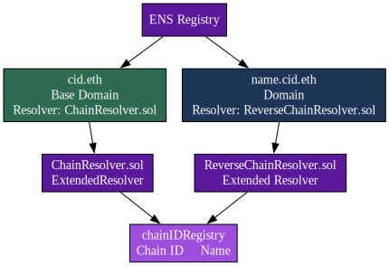
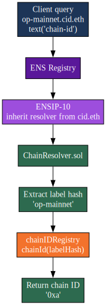
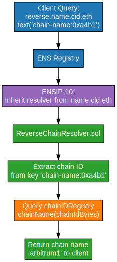

# Chain Resolver Overview

This repo packages ChainResolver, an ENSIP-10 compatible resolver that maps between chain labels and chain IDs. The forward resolver ([`ChainResolver.sol`](src/ChainResolver.sol)) answers standard ENS record queries for any first-label hash, while the reverse resolver ([`ReverseChainResolver.sol`](src/ReverseChainResolver.sol)) turns raw chain IDs back into readable labels.

### Why this structure works
- Everything is keyed by the label hash instead of a fixed node. That keeps us agnostic about whether the namespace lives at `cid.eth`, `on.eth`, `l2.eth`, or anything else—we can pick the final hierarchy later without migrating records.
- `ChainResolver` is a fully featured ENS resolver. Once a chain label is registered, its owner (or authorised operator) can set addresses, `contenthash`, `avatar` records for chain icons, and any other ENS text/data fields they need.
- `IChainIDRegistry` [interface](https://github.com/nxt3d/chain-resolver/blob/bc5a00af4e3b8d196d90c454636120da3f71ff6a/src/ChainResolver.sol#L22) exposes just the `chainId` and `chainName` getters suggested by this resolver, giving other teams freedom to wrap those reads with whatever registry design or governance model they prefer.
- We introduce the new `data()` pathway suggested in [ENSIP-TBD-19](https://github.com/nxt3d/ensips/blob/ensip-ideas/ensips/ensip-TBD-19.md) so clients can request the raw chain ID bytes. Adoption will take time, so we still serve `text(..., "chain-id")` as a fallback for current tooling.
- Reverse resolution adopts Service Key Parameters from [ENSIP-TBD-17](https://github.com/nxt3d/ensips/blob/ensip-ideas/ensips/ensip-TBD-17.md) by storing values under `chain-name:<chainId>`.

## Architecture

### Full Topology


### ChainResolver.sol `resolve()`

`ChainResolver.sol` handles the full suite of ENS selectors like addresses, multi-coin addresses, content hashes, text records, and the newer `data()` lookups—so existing tooling can talk to it without changes. 

```solidity
function resolve(bytes calldata name, bytes calldata data) external view override returns (bytes memory) {
    (bytes32 labelHash,,,) = NameCoder.readLabel(name, 0, true);
    bytes4 selector = bytes4(data);

    if (selector == TEXT_SELECTOR) {
        (, string memory key) = abi.decode(data[4:], (bytes32, string));
        if (keccak256(bytes(key)) == keccak256(bytes("chain-id"))) {
            // Current clients expect a hex string
            return abi.encode(HexUtils.bytesToHex(chainIDRegistry.chainId(labelHash)));
        }
        return abi.encode(textRecords[labelHash][key]);
    }

    if (selector == DATA_SELECTOR) {
        (, bytes memory key) = abi.decode(data[4:], (bytes32, bytes));
        if (keccak256(key) == keccak256(bytes("chain-id"))) {
            // ENSIP-TBD-19: raw bytes for future adopters
            return chainIDRegistry.chainId(labelHash);
        }
        return abi.encode(dataRecords[labelHash][key]);
    }
}
```

- `text(bytes32 node, string key)` with `key = "chain-id"` stays the default path until clients migrate.
- `data(bytes32 node, bytes key)` with `key = "chain-id"` is the new binary channel so the same resolver can serve both generations of integrations.

### Chain Resolution Flow



## ReverseChainResolver.sol

```solidity
string public constant CHAIN_NAME_TEXT_PREFIX = "chain-name:";
string public constant CHAIN_NAME_DATA_PREFIX = "chain-name:";
```

- Reverse queries use Service Key Parameters (ENSIP-TBD-17). Clients call `text(bytes32,string)` or `data(bytes32,bytes)` with keys like `chain-name:0xa4b1`, and the resolver looks up the chain name through the same registry (`resolve` in `src/ReverseChainResolver.sol`).
- The forward label hash is ignored, so this resolver can attach to any reverse domain (for example `reverse.name.cid.eth`).

### Reverse Resolution Flow



## References

- ENSIP-10 Extended Resolver flow (resolve calldata fan-out).
- Data record proposal [ENSIP-TBD-19](https://github.com/nxt3d/ensips/blob/ensip-ideas/ensips/ensip-TBD-19.md) (binary `data()` responses for chain IDs).
- Service Key Parameters [ENSIP-TBD-17]( https://github.com/nxt3d/ensips/blob/ensip-ideas/ensips/ensip-TBD-17.md) for reverse resolution.