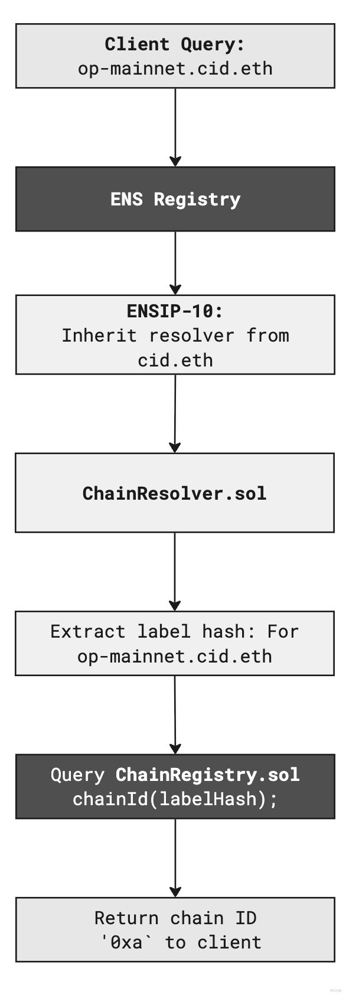
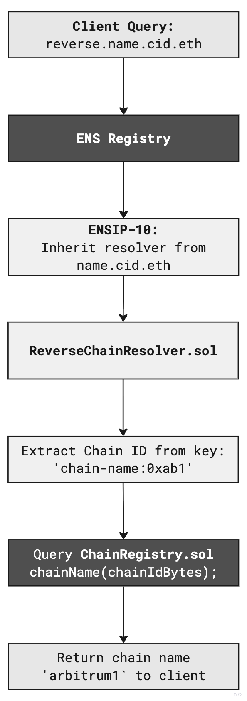

# On-chain Registry Overview

This repo packages an on‑chain registry — [ChainRegistry](src/ChainRegistry.sol) — and resolvers that map human‑readable chain labels to chain identifiers and vice versa. The resolvers implement the wildcard resolution defined by [ENSIP‑10](https://docs.ens.domains/ensip/10/). The forward resolver ([`ChainResolver.sol`](src/ChainResolver.sol)) responds to ENS record queries for any labelhash, while the reverse resolver ([`ReverseChainResolver.sol`](src/ReverseChainResolver.sol)) turns chain identifiers back into readable labels.

### Why this structure works
- Everything is keyed by the labelhash. That keeps us agnostic about whether the namespace lives at `cid.eth`, `on.eth`, `l2.eth`, or anything else. We can pick the final hierarchy later without migrating records.
- `ChainResolver` is a fully featured ENS resolver. Once a chain label is registered, its owner (or authorised operator) can set addresses, `contenthash`, `avatar` records for chain icons, and any other ENS text/data fields they need.
- The `IChainRegistry` [interface](src/interfaces/IChainRegistry.sol) exposes just the `chainId` and `chainName` getters suggested by this resolver, giving other teams freedom to wrap those reads with whatever registry design or governance model they prefer.
- We introduce the `chain-id` text record with [ENSIP-TBD-18](https://github.com/nxt3d/ensips/blob/ensip-ideas/ensips/ensip-TBD-18.md) which defines a new global text-record.
- We introduce the new `data(bytes32 node, bytes key)` pathway where `key = bytes('chain-id')`. This is suggested in [ENSIP-TBD-19](https://github.com/nxt3d/ensips/blob/ensip-ideas/ensips/ensip-TBD-19.md). Adoption will take time, so we still serve the introduced `chain-id` text-record above as a fallback for current tooling.
- Reverse resolution adopts Service Key Parameters from [ENSIP-TBD-17](https://github.com/nxt3d/ensips/blob/ensip-ideas/ensips/ensip-TBD-17.md) by storing values under `chain-name:<chainId>`.

## Architecture

### Full Topology


### ChainRegistry

Source code lives in our fork of Wonderland’s L2Resolver: https://github.com/nxt3d/Wonderland_L2Resolver/blob/dev/src/contracts/L2Resolver.sol

Register a chain with:

`register(string _chainName, address _owner, bytes _chainId)`

On registration, the registry persists both directions using the labelhash of `_chainName`:
- Forward: `labelhash(_chainName)` → `_chainId`, `_chainName`
- Reverse: `_chainId` (bytes) → `labelhash(_chainName)`

Resolvers consume two read methods from the registry:

```solidity
interface IChainRegistry {
  function chainName(bytes calldata _chainIdBytes) external view returns (string memory _chainName);
  function chainId(bytes32 _labelHash) external view returns (bytes memory _chainId);
}
```

See [ChainRegistry.sol](src/ChainRegistry.sol) for more details.

### ChainResolver

`ChainResolver.sol` handles the full suite of ENS selectors like addresses, multi-coin addresses, content hashes, text records, and the newer `data()` lookup. 

```solidity
function resolve(bytes calldata name, bytes calldata data) external view override returns (bytes memory) {
    (bytes32 labelHash,,,) = NameCoder.readLabel(name, 0, true);
    bytes4 selector = bytes4(data);

    if (selector == TEXT_SELECTOR) {
        (, string memory key) = abi.decode(data[4:], (bytes32, string));
        if (keccak256(bytes(key)) == keccak256(bytes("chain-id"))) {
            // Current clients expect a hex string
            return abi.encode(HexUtils.bytesToHex(chainIDRegistry.chainId(labelHash)));
        }
        return abi.encode(textRecords[labelHash][key]);
    }

    if (selector == DATA_SELECTOR) {
        (, bytes memory key) = abi.decode(data[4:], (bytes32, bytes));
        if (keccak256(key) == keccak256(bytes("chain-id"))) {
            // ENSIP-TBD-19: raw bytes for future adopters
            return chainIDRegistry.chainId(labelHash);
        }
        return abi.encode(dataRecords[labelHash][key]);
    }
}
```

- `text(bytes32 node, string key)` with `key = "chain-id"` stays the default path until clients migrate.
- `data(bytes32 node, bytes key)` with `key = bytes("chain-id")` is the new binary channel so the same resolver can serve both generations of integrations.

### Chain Resolution Flow

<p align="center">
  
  
</p>

## ReverseChainResolver

- [ReverseChainResolver](src/ReverseChainResolver.sol) is also an ENSIP‑10 wildcard resolver that uses Service Key Parameters suggested in ENSIP‑TBD‑17. Clients call `text(bytes32,string)` or `data(bytes32,bytes)` with keys like `chain-name:0xa4b1`, and the resolver looks up the chain name through the same registry. See `resolve()` in `src/ReverseChainResolver.sol`.
- The left-most label (the chain identifier) is ignored, so this resolver can be attached to any reverse namespace (for example, reverse.name.cid.eth).

### Reverse Resolution Flow

<p align="center">
  
  
</p>


## Development

```bash
forge install
bun install
```

### Resolver Integration test

```bash
bun run test/ChainResolver.fork.test.ts 
```

Requires a `SEPOLIA_RPC_URL` in `.env` ; if unset the test
falls back to a default RPC endpoint.

### Reverse Resolver Integration test:

```bash
bun run test/ReverseChainResolver.fork.test.ts
```

## Test & Resolve Workflow

1) Deploy contracts

```bash
bun run deploy/DeployENSChainRegistry.ts --chain=sepolia
```

2) Capture deployed addresses and put them in your `.env`:

```
# ChainResolver (forward resolver) deployed address
# Read by: deploy/ResolveByLabel.ts
CHAIN_RESOLVER_ADDRESS=0x...

# ChainRegistry deployed address
# Read by: deploy/RegisterChainAndSetRecords.ts
CHAIN_REGISTRY_ADDRESS=0x...

# ReverseChainResolver deployed address
# Read by: deploy/ReverseResolveByChainId.ts
REVERSE_RESOLVER_ADDRESS=0x...
```

3) Register a chain and set records

```bash
bun run deploy/RegisterChainAndSetRecords.ts --chain=sepolia
```

4) Resolve by label

```bash
bun run deploy/ResolveByLabel.ts --chain=sepolia
```

5) Reverse resolve by chain-id

```bash
bun run deploy/ReverseResolveByChainId.ts --chain=sepolia
```


## References
- [ENSIP-5](https://docs.ens.domains/ens-improvement-proposals/ensip-5-text-records) &mdash; Text record conventions (`text(bytes32 node, string key)`).
- [ENSIP-10](https://docs.ens.domains/ens-improvement-proposals/ensip-10-multi-coin-support) &mdash; Wildcard resolution flow (`resolve(bytes,name)` fan-out).
- [ENSIP-TBD-17](https://github.com/nxt3d/ensips/blob/ensip-ideas/ensips/ensip-TBD-17.md) &mdash; Service Key Parameters for reverse resolution.
- [ENSIP-TBD-18](https://github.com/nxt3d/ensips/blob/ensip-ideas/ensips/ensip-TBD-18.md) &mdash; Global `chain-id` text record definition.
- [ENSIP-TBD-19](https://github.com/nxt3d/ensips/blob/ensip-ideas/ensips/ensip-TBD-19.md) &mdash; Binary `data()` record proposal for chain IDs.
- [Chain Registry](https://github.com/nxt3d/Wonderland_L2Resolver/blob/dev/src/contracts/L2Resolver.sol) - Proposed Registry
